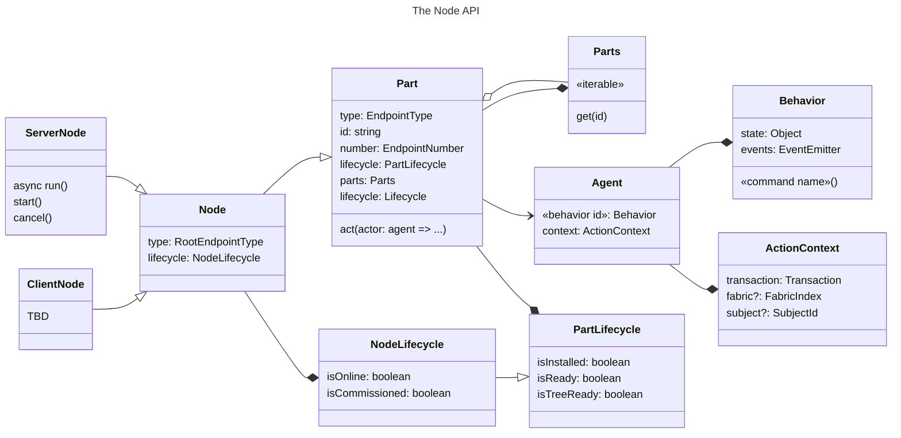

# Matter.js Node API

## Introduction

The *Node API* offers a high-level interface for implementing and interacting with Matter nodes.  A *node* in Matter is
a top-level network-accessible resource.

> [!NOTE]
> Don't confuse Matter "nodes" with Node.js.  You can use the Node API from Node.js but it it not specific to Node.js.

Most nodes are physical devices.  The Matter specifications use the term *device* informally to describe nodes
associated with a real-world device such as a light switch, door lock or window covering.

A *controller* is a node that manages other nodes and commissions them into a fabric specific to the controller.  In
Matter, a *fabric* is a private namespace associated with an specific controller.  Nodes may be associated with more
than one controller and thus more than one fabric.

Common controllers include Apple HomePod, Amazon Echo and Google Nest Hub.

A *bridge* is a node that publishes non-Matter devices as Matter nodes.  Bridges are often provided by third parties
to publish nodes for devices that do not have native Matter support.  You can use Matter.js to create a bridge.

## High-level overview

You can look through Matter.js examples to get a feel for how you might use the Node API in your application.
Familiarity with a few concepts described here might be helpful as you browse the examples.

### Nodes and Parts

*TODO*

### Agents and Behaviors

*TODO*