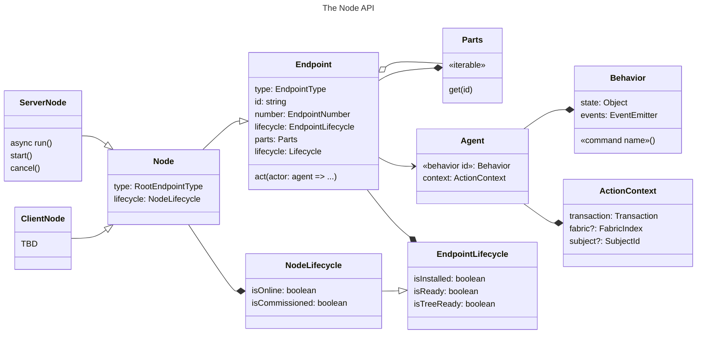

# Matter.js Node API

## Introduction

The _Node API_ offers a high-level interface for implementing and interacting with Matter nodes. A _node_ in Matter is
a top-level network-accessible resource.

> [!NOTE]
>
> Don't confuse Matter "nodes" with Node.js. You can use the Node API from Node.js but it it not specific to Node.js.

This document gives a high-level overview of key Matter concepts and how they map to the Matter.js API.

## High-level overview of Matter.js

You can look through Matter.js examples to get a feel for how you might use the Node API in your application.
Familiarity with a few concepts described here might be helpful as you browse the examples.



## Nodes

Most nodes are physical devices. The Matter specifications use the term _device_ informally to describe nodes
associated with a real-world device such as a light switch, door lock or window covering.

A _controller_ is a node that manages other nodes and commissions them into a fabric specific to the controller. In
Matter, a _fabric_ is a private namespace associated with an specific controller. Nodes may be associated with more
than one controller and thus more than one fabric.

Common controllers include Apple HomePod, Amazon Echo and Google Nest Hub.

A _bridge_ is a node that publishes non-Matter devices as Matter nodes. Bridges are often provided by third parties
to publish nodes for devices that do not have native Matter support. You can use Matter.js to create a bridge.

In Matter.js you can create a device or bridge using [Server Node](./ServerNode.ts).

[Server Node](./ServerNode.ts) is a server-side implementation of the [Node](./Node.ts) interface. The
[Node](../node/Node.ts) interface is common to both servers (devices and bridges) and clients (controllers).

> [!NOTE]
>
> Matter.js supports controllers via [CommissioningController](../CommissioningController.ts) but we have not yet
> implemented the higher-level [ClientNode](./ClientNode.ts) class.

Here is how you instantiate a node and bring it online:

```ts
// ../../../matter-node.js-examples/src/tutorial/example01.ts

import { ServerNode } from "@matter/main";

const node = await ServerNode.create();

await node.run();
```

This example starts and publishes your node but of course you must add additional functionality to make the Node useful.

> [!NOTE]
>
> The boilerplate import referencing "matter-node.js" above is necessary to load Node.js-specific extensions to
> Matter.js.

### Endpoints

A Matter _endpoint_ is an individually addressable element of a Matter node.

Matter defines the functionality supported by an endpoint using a unique numerical _endpoint type_. The endpoint type
designates a set of clusters associated with the endpoint. A _cluster_ is a functional interface to a set of related
functionality such as "window covering" or "pump control".

Matter.js defines endpoint types using [EndpointType](../endpoint/type/EndpointType.ts). We provide predefined
EndpointTypes all endpoint types for all device types defined by the Matter standard in
[endpoint/definitions/device](../endpoint/definitions/).

A node consists of a [RootEndpoint](../endpoint/definitions/system/RootEndpoint.ts) and one or more other endpoints
specific to the node's function.

In Matter.js endpoints are instances of the [Endpoint](../endpoint/Endpoint.ts) class.

You can add an endpoint to a node by supplying the endpoint's DeviceType to the node:

```ts
// ../../../matter-node.js-examples/src/tutorial/example02.ts

import { OnOffLightDevice } from "@matter/main/devices/OnOffLightDevice";
import { ServerNode } from "@matter/main";

const node = await ServerNode.create();

await node.add(OnOffLightDevice);

await node.run();
```

This publishes a node with a working "on/off" cluster. However it's still not useful until you customize the on/off
cluster to control your actual device.

### Behaviors

A Matter.js [Endpoint](../endpoint/Endpoint.ts) defines functionality as a composition of
[Behavior](../behavior/Behavior.ts) classes. A _behavior_ is a JavaScript object that adds functionality to an
endpoint.

Matter.js includes predefined behaviors for all standard Matter clusters. Some of these behaviors are fully functional
without any effort on your part. In other cases the behavior is only useful if modified for your application.

The following example extends [OnOffServer](../behavior/definitions/on-off/OnOffServer). OnOffServer is a Matter.js
[Behavior](../behavior/Behavior.ts) implementing the Matter "on/off" cluster.

```ts
// ../../../matter-node.js-examples/src/tutorial/example03.ts

import { OnOffLightDevice, OnOffLightRequirements } from "@matter/main/devices/OnOffLightDevice";
import { ServerNode } from "@matter/main";

class MyOnOffServer extends OnOffLightRequirements.OnOffServer {
    override on() {
        console.log("Turning on");
    }

    override off() {
        console.log("Turning off");
    }
}

const node = await ServerNode.create();

await node.add(OnOffLightDevice.with(MyOnOffServer));

await node.run();
```

This illustrates how you use Matter.js to customize behaviors. In this case we override the functionality for two
commands on the Matter cluster, "on" and "off". A _command_ is an element of a Matter cluster that other nodes may
invoke remotely. Matter.js maps commands to specific behavior methods.

> [!NOTE]
>
> For `MyOnOffServer` we extend `OnOffLightRequirements.OnOffServer` rather than extending `OnOffServer` directly. This
> is because the Matter specification specifies other mandatory changes to the on/off cluster. Matter.js makes those
> changes for us in [OnOffLightRequirements](../behavior/definitions/on-off/OnOffBehavior.ts).

### State and events

In addition to commands, Matter clusters may define two other types of elements, "attributes" and "events".

An _attribute_ is a value associated with a cluster that another node may read or write. A node may also subscribe to
an attribute to receive updates when the attributes value changes.

Matter.js exposes attribute values in a [Behavior](../behavior/Behavior.ts) property called "state". `behavior.state`
contains a property for each attribute supported by a cluster.

An _event_ is data value that another node may subscribe to. Events are not associated with fixed values like
attributes but events themselves are semi-persistent.

Matter.js exposes events in a [Behavior](../behavior/Behavior.ts) property called "events". Each event supported by a
cluster has a corresponding `behavior.events` property that is a Matter.js [Observable](../util/Observable.ts).

Additionally, `behavior.events` has a property of the form `attributeName$change` for each cluster attribute. You may
use this event to listen for attribute changes.

In this example we use events and state to customize [OnOffServer](../behavior/definitions/on-off/OnOffServer):

```ts
// ../../../matter-node.js-examples/src/tutorial/example04.ts

import { OnOffLightDevice } from "@matter/main/devices/OnOffLightDevice";
import { ServerNode } from "@matter/main";

const node = await ServerNode.create();

const light = await node.add(OnOffLightDevice);

light.events.onOff.onOff$Change.on(newValue => {
    console.log(`Light is ${newValue ? "on" : "off"}`);
});

await node.run();
```

This example demonstrates how to use events. You define the events in the behavior but the endpoint makes them
available as `endpoing.events.clusterName.eventName`. You can use methods `on` and `off` to subscribe and unsubscribe
to events.

Similarly to events, you define attributes in a behavior but the endpoint makes them available as
`endpoint.state.clusterName.attributeName`;

### Advanced Concepts

We do not cover the following in detail here but call them out because you may encounter them in the Matter.js API.

A Matter.js [ActionContext](../behavior/context/ActionContext.ts) captures details about the remote node or internal
process interacting with the Matter.js API. All interactions with the Node API have an ActionContext either implicitly
or explicitly. Matter.js uses information from the context to enforce access rights and implement transactionality.

In Matter.js, changes to state are transactional. This means your state will not be visible in other contexts until
the transaction commits. If there is an error in your code, the transaction will roll back and your changes will be
reverted. This is controlled by the `transaction` property of `ActionContext`, which is a
[Transaction](../behavior/state/transaction/Transaction.ts).

[Agent](../endpoint/Agent.ts) is a Matter.js class that brings together an
[ActionContext](../behavior/context/ActionContext.ts) with an [Endpoint](../endpoint/Endpoint.ts). Conceptually an
_agent_ is a standin for an endpoint that provides direct access to the endpoint's behaviors. You can access the
ActionContext as `agent.context` and each behavior instance as `agent.behaviorName`.

For most interactions with an endpoint Matter.js manages agents, contexts and transactions for you. However in some
circumstances you may benefit from invoking commands locally or modifying attributes across multiple clusters
atomically. You can use `endpoint.act` to obtain an Agent for this type of advanced use case.

In the following contrived example we use `act` to manually invoke the Matter "toggle" command and then print the
results:

```ts
// ../../../matter-node.js-examples/src/tutorial/example05.ts

import { OnOffLightDevice } from "@matter/main/devices/on-off-light-device";
import { ServerNode } from "@matter/main";

const node = await ServerNode.create();

const light = await node.add(OnOffLightDevice);

await node.start();

await light.act(async agent => {
    await agent.onOff.toggle();
    console.log("On/off state after first toggle", agent.onOff.state);

    await agent.onOff.toggle();
    console.log("On/off state after second toggle", agent.onOff.state);
});

await node.close();
```

> [!NOTE]
>
> `start` starts a node and waits for it to go online. `close` shuts the node down and releases its resources.

### Further reading

We offer annotated [examples](../../../matter-node.js-examples/src/) that illustrate more advanced uses of the Matter.js
API including bridges and other advanced device types.
